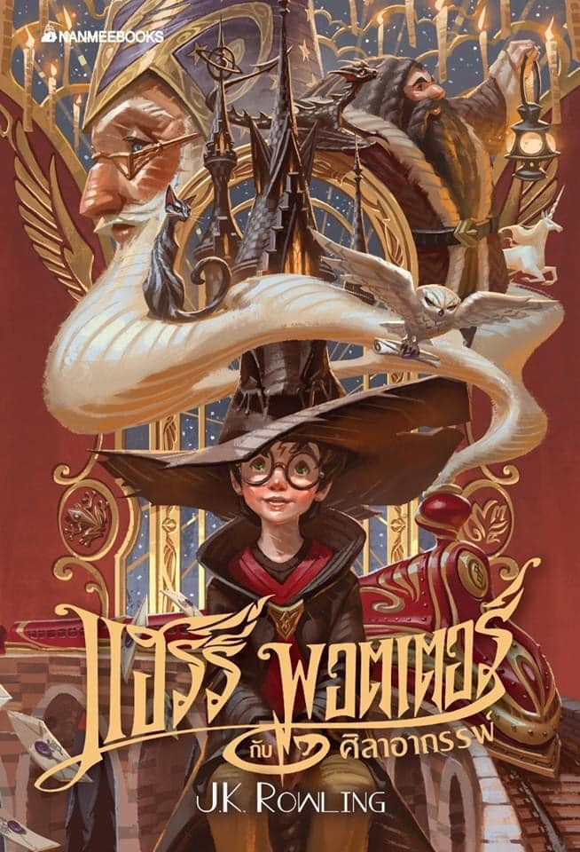

# 2022_Fall_ISY5001 GROUP1 Project: Book Ranking and Category Detection

## SECTION 1 : Book cover example

---  
## SECTION 2 : EXECUTIVE SUMMARY / PAPER ABSTRACT
Book genre classification is one of the popular sections among all NLP areas back in time, and it is widely used
in many situations such as libraries, book donation charities, or even simply data-mining programs. There are
basically three ways of determining the genre of a selected book.
• Classification with Titles
• Classification with Contents
• Classification with Covers
Do note that the classification with covers can be divided into two sub-classes which are text recognition
which ultimately belongs to Natural Language Processing area and Image Classification which belongs to the
Computer Vision area.
On the premise that the current book classification system has been able to effectively classify books according
to book information, our goal is to develop a system that can use limited data to classify books as accurately
as possible and achieve our goals at a relatively faster speed. The system should also be able to read the
cover of the book and ’grade’ the book with its cover on scale from 0-4, the score implies the possible degree
of popularity of the input book.
## SECTION 2 : VIDEO OF SYSTEM MODELLING & USE CASE DEMO
`Please refer to the video at Github Folder: video instruction`

`<Folder Link>` : <https://github.com/HHRRXX/2022_Fall_ISY5001/tree/main/video%20instruction>  
`Video of System Demo`: https://github.com/HHRRXX/2022_Fall_ISY5001/blob/main/video%20instruction/Demo_Vedio.mp4  
`Video of Instruction`: https://github.com/HHRRXX/2022_Fall_ISY5001/blob/main/video%20instruction/Project_Introduction.mp4  

---

## SECTION 3 : USER GUIDE
- System Requirements and Dependencies  

    Run `pip install -r requirements.txt` in the terminal

- Steps on running of the system demo

    Run `flask run` in the terminal  
    Copy the local URL to your web browser

---
## SECTION 4 : PROJECT REPORT / PAPER
`Please refer to Project_Report.pdf`

`<File Link>` : <https://github.com/HHRRXX/2022_Fall_ISY5001/blob/main/ISY5001_Project_Report.pdf>

---

**The [Machine Reasoning (MR)](https://www.iss.nus.edu.sg/executive-education/course/detail/machine-reasoning "Machine Reasoning"), [Reasoning Systems (RS)](https://www.iss.nus.edu.sg/executive-education/course/detail/reasoning-systems "Reasoning Systems") and [Cognitive Systems (CGS)](https://www.iss.nus.edu.sg/executive-education/course/detail/cognitive-systems-sf "Cognitive Systems") courses are part of the [Master of Technology in Intelligent Systems](https://www.iss.nus.edu.sg/stackable-certificate-programmes/intelligent-systems "Intelligent Reasoning Systems") offered by [NUS-ISS](https://www.iss.nus.edu.sg "Institute of Systems Science, National University of Singapore").**
